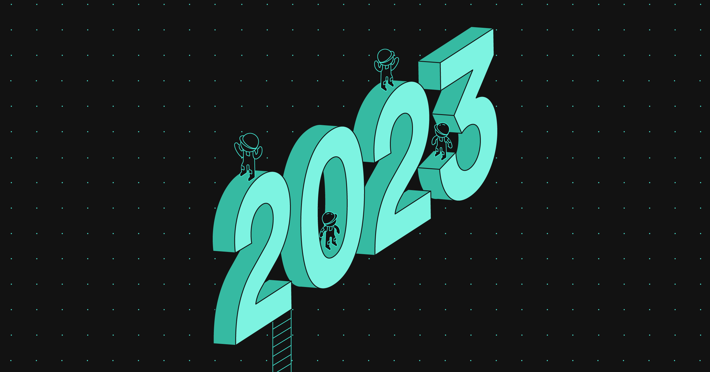

# What’s Ahead in 2023?

Okay, everyone. Time to move on from all the 2022 reflections, Top 10 lists, and Wrapped(s), and turn our gaze in the other direction — towards 2023. As the Backstage team moves into the new year, we find ourselves asking those perennial questions: How can we continue to grow and enhance the Backstage community? How can we improve the experience for those adopting Backstage? How can we give the best support to Backstage contributors?

Well, we don’t have all the answers, but we do have some. So we wanted to share more on three ongoing initiatives aimed at moving the needle forward for these three distinct, yet interrelated, questions.

- Grow your influence by climbing the contribution ladder
- Come join our SIGs (and push for new ones)
- Work with us to drive a better experience for Backstage adopters

# Climb the contribution ladder

Truth be told, we’ve been wanting to grow the maintainer team for some time, and have had multiple requests from contributors and contributing organizations wanting to become maintainers. But, so far, we just haven’t managed to get anything off the ground. What we see is that becoming a maintainer is too hard and the current ownership model doesn’t work. In short, we need to update Backstage governance.

To address this, we are proposing (RFC links below) the following three initiatives:

- Introduce more steps in between first-time contributor and maintainer in the form of a contributor ladder (loosely based on the [CNCF Project Template](https://github.com/cncf/project-template/blob/main/CONTRIBUTOR_LADDER.md)). The ladder might look as follows: Contributor, Org Member, Reviewer, Maintainer, Project Maintainer.
- Change the ownership model, for example, divide the project up into several project areas, each covering particular parts of the project.
- Introduce a new process for large contributions in the form of Backstage Enhancement Proposals (BEPs).

Read more and join the already rich discussion in [RFC: Updated Backstage Governance](https://github.com/backstage/backstage/issues/15317) and [RFC: Backstage Enhancement Proposals](https://github.com/backstage/backstage/issues/15318). The RFC will be open until 13/02/2023.

# Come join our SIGs (and push for new ones)

As many of you know, SIG stands for Special Interest Group. The purpose of a SIG is to bring together maintainers and interested contributors within a certain specialist area to discuss, debate, spread knowledge, brainstorm - and drive the overall project forward. They’re also a lot of fun!

We currently have two SIGs up and running:

- [Catalog](https://github.com/backstage/community/tree/main/sigs/sig-catalog?utm_campaign=Newsletters%20Sent&utm_medium=email&_hsmi=241130993&_hsenc=p2ANqtz-9fx-nTmQga2j12NqzZaL-lYPq-xQjDoXcWKe_JUoa2RGlK65R9j0CIygfYILr0tGEQSvRVN9xzhiJ6LmVxBthKnStfSA&utm_content=241130993&utm_source=hs_email) started up last June and covers all aspects of the systems and components related to the Software Catalog. The group runs every second Tuesday between 16:00 and 17:00 CET. Just show up or hop into [#catalog](https://discord.com/channels/687207715902193673/923144214580191282) (Discord), if you want to talk to us first. Here are the [notes from our sessions so far](https://docs.google.com/document/d/1xg57CDfX2R5jTGbbWANzifm2szEb664kuTwfEEvKgZU/edit#heading=h.iw0hjv6xfb9e).
- [Adoption](https://github.com/backstage/community/tree/main/sigs/sig-adoption?utm_campaign=Newsletters%20Sent&utm_medium=email&_hsmi=241130993&_hsenc=p2ANqtz-9CAxtT8JSeJZPh41o3ZnDBi0VBFpbL6fEqXInr9HHOFhU3JAo8HekKg1JzE5rhGP5zOaHcsYDd1YxJWNHw-eSk5mLWkA&utm_content=241130993&utm_source=hs_email) kicked off in December and covers all aspects of the Backstage adoption journey including documentation and tutorials. In the first two meetups, we discussed adoption challenges based on user persona, collecting data about those challenges, and bootstrapping the Catalog to improve metadata quality for adopters. This one runs every second Thursday between 16:00 and 17:00 CET. Again just show up or, if you want to talk to us first, you can do so in [#adoption](https://discord.com/channels/687207715902193673/1045031039061479536) (Discord). Here are the [notes from our sessions](https://docs.google.com/document/d/1zeYSzXYgh897bxPQmwy2btOwCFlEjlUDLf00riySLRc/edit?_hsmi=241130993&_hsenc=p2ANqtz-_nPuE5hW4fnbhJ5-uK8r5HisSTU7rkslKirvqu0g-vdynbitPVYF2AVLAatos2dLoxb2Bgx_g4LBgH02kXoq7_Acd43Q#heading=h.iw0hjv6xfb9e) so far.

So that’s SIGs. Get involved and join the ones we have up and running. And/or feel free to propose new ones.

# Help drive a better experience for all adopters

Throughout all stages of adopting Backstage in an organization — initial discovery, evaluation and POC, and scaling to the wider org — we have identified opportunities where we want to make the journey for Backstage adopters faster and smoother.

We’ll go step-by-step, but initial plans are to:

- Make it easier to install, customize, and maintain Backstage
- Provide Golden Paths for adoption
- Improve the experience and the content on [backstage.io](https://backstage.io/docs/overview/what-is-backstage)

As we move forward, we’d love you to be part of it. Here are some ways that you can contribute to this initiative:

- Simply give us feedback. [Tell us about your adoption journey](https://spotify.co1.qualtrics.com/jfe/form/SV_cuxhYPB6oQDu7gW).
- Contribute to the pages and documentation on [backstage.io](https://backstage.io/docs/overview/what-is-backstage)
- Pay it forward by making code contributions even during your adoption journey (if you are on one)
- Join the [Adoption](https://github.com/backstage/community/tree/main/sigs/sig-adoption?utm_campaign=Newsletters%20Sent&utm_medium=email&_hsmi=241130993&_hsenc=p2ANqtz-9CAxtT8JSeJZPh41o3ZnDBi0VBFpbL6fEqXInr9HHOFhU3JAo8HekKg1JzE5rhGP5zOaHcsYDd1YxJWNHw-eSk5mLWkA&utm_content=241130993&utm_source=hs_email) SIG
- Chat with us on [#adoption](https://discord.com/channels/687207715902193673/1045031039061479536) (Discord)
