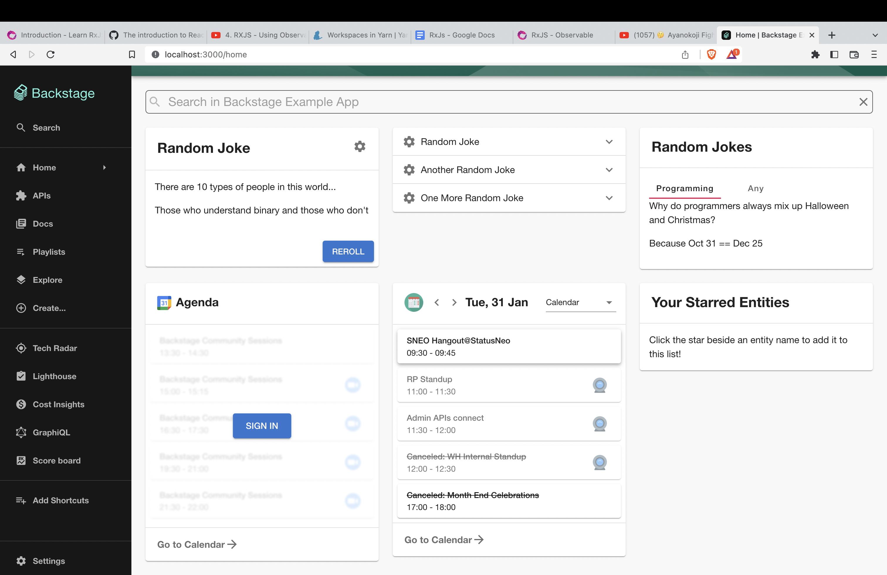

# Microsoft-Calendar Plugin

Welcome to the Microsoft calendar plugin!
_This plugin was created through the Backstage CLI_

## Features

1. You can switch between calendars, using the select menu on the calendar card header.
2. Card showing the list of events on the selected date and the selected calendar (provided by Outlook calendar).
3. Link to join the online meeting on the event card if provided. so you can join your meetings right away hassle-free.
4. Hovering over the event will pop over a card showing the event summary message, and list of attendees.
5. attendee's chips will have a badge over them symbolizing their responses.
   - green --> accepted
   - red --> declined
   - nothing --> not responded yet

## Setup

The following sections will help you set up the Microsoft calendar plugin.

### Microsoft azure authentication provider

> You need to setup [Microsoft Azure authentication provider](https://backstage.io/docs/auth/microsoft/provider), before you move forward with any of the below step if you haven't already.

1. Install the plugin by running this command

```bash
# From the Backstage repository root
yarn add --cwd packages/app @backstage/plugin-microsoft-calendar
```

2. Import the Microsoft calendar React component from `@backstage/plugin-microsoft-calendar`.
3. You can then use the provided React component `MicrosoftCalendar` in the backstage frontend where ever you want

```tsx
import { MicrosoftCalendar } from '@backstage/plugin-microsoft-calendar';

// ...
<Grid item xs={12} md={4}>
  <MicrosoftCalendar />
</Grid>;
// ...
```




You can also serve the plugin in isolation by running `yarn start` in the plugin directory.
This method of serving the plugin provides quicker iteration speed and a faster startup and hot reloads.
It is only meant for local development, and the setup for it can be found inside the [/dev](./dev) directory.
